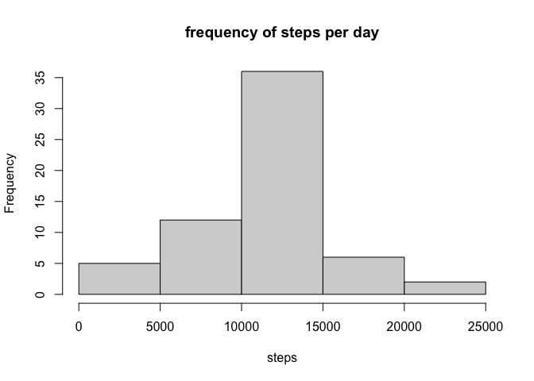

# Notes about the data
* The data for this assignment can be downloaded from the course web site: [Dataset: Activity monitoring data](https://d396qusza40orc.cloudfront.net/repdata%2Fdata%2Factivity.zip)

* The variables included in this dataset are:

      steps: Number of steps taking in a 5-minute interval (missing values are coded as NA)
      
      date: The date on which the measurement was taken in YYYY-MM-DD format
      
      interval: Identifier for the 5-minute interval in which measurement was taken

* The dataset is stored in a comma-separated-value (CSV) file and there are a total of 17,568 observations in this dataset.

# Processing the data
1. Load the data (i.e.read.csv())
2. Process/transform the data (if necessary) into a format suitable for your analysis


```r
if(!file.exists("data")){dir.create("data")} #create folder named data if it does not exist already
fileurl <- "https://d396qusza40orc.cloudfront.net/repdata%2Fdata%2Factivity.zip" #make file varibale
download.file(fileurl, destfile = "./data/activity_monitoring_data.zip") #save the file  

unzip(zipfile = "./data/activity_monitoring_data.zip", exdir = "./data") #unzip the file into data folder
activity_data <- read.csv("./data/activity.csv", na.strings = "NA") #read the file in and note NA strings are NA
```


# What is mean total number of steps taken per day?
*For this part of the assignment, you can ignore the missing values in the dataset.* 


```r
#Check if which rows if any have NA values
colnames(activity_data[ apply(activity_data, 2, anyNA) ]) #returns "steps"
```

```
## [1] "steps"
```

```r
#remove NA values
activity_data_complete <-na.omit(activity_data)
```


1. Calculate the total number of steps taken per day

```r
steps_day <- aggregate(steps ~ date, activity_data_complete, sum) #use aggregate to sum the number of total steps for each day
head(steps_day)
```

```
##         date steps
## 1 2012-10-02   126
## 2 2012-10-03 11352
## 3 2012-10-04 12116
## 4 2012-10-05 13294
## 5 2012-10-06 15420
## 6 2012-10-07 11015
```

2. If you do not understand the difference between a histogram and a barplot, research the difference between them. Make a histogram of the total number of steps taken each day

```r
hist(steps_day$steps, xlab = "steps", main = "frequency of steps per day")
```

<!-- -->

3. Calculate and report the mean and median of the total number of steps taken per day

```r
days <- length(unique(activity_data_complete$date)) #get the number of unique days
steps <- sum(activity_data_complete$steps) #sum the total number of steps taken
steps_per_day <- round(steps/days) #calculate the number of steps per day, round to nearest whole number (can't take half steps)
print(steps_per_day)
```

```
## [1] 10766
```

```r
#OR

summary(steps_day) #gives mean and median quickly
```

```
##      date               steps      
##  Length:53          Min.   :   41  
##  Class :character   1st Qu.: 8841  
##  Mode  :character   Median :10765  
##                     Mean   :10766  
##                     3rd Qu.:13294  
##                     Max.   :21194
```

```r
#Median is 10765
#Mean is 10766
```


# What is the average daily activity pattern?
1. Make a time series plot (i.e.type = "l") of the 5-minute interval (x-axis) and the average number of steps taken, averaged across all days (y-axis)


```r
#use aggregate to sum the number of total steps for each day
steps_interval <- aggregate(steps ~ interval, activity_data_complete, mean) 

#plot using baseplot system
plot(steps_interval$interval, 
     steps_interval$steps, 
     type='l', 
     main="Average number of steps across all days", xlab="Interval", 
     ylab="Average number of steps"
     ) 
```

<!-- -->


2. Which 5-minute interval, on average across all the days in the dataset, contains the maximum number of steps?

```r
#find max number of steps location
max_steps <- which.max(steps_interval$steps) 

#find corresponding interval
steps_interval[max_steps,]
```

```
##     interval    steps
## 104      835 206.1698
```


# Imputing missing values
*Note that there are a number of days/intervals where there are missing values (coded as NA). The presence of missing days may introduce bias into some calculations or summaries of the data.*

1. Calculate and report the total number of missing values in the dataset (i.e. the total number of rows with NAs)

```r
#Check if which rows if any have NA values
colnames(activity_data[ apply(activity_data, 2, anyNA) ]) #returns "steps"
```

```
## [1] "steps"
```

```r
#find sum of how many missing values
sum(is.na(activity_data$steps)) 
```

```
## [1] 2304
```

2. Devise a strategy for filling in all of the missing values in the dataset. The strategy does not need to be sophisticated. For example, you could use the mean/median for that day, or the mean for that 5-minute interval, etc.
3. Create a new dataset that is equal to the original dataset but with the missing data filled in.


```r
activity_data_new <- activity_data     #create a duplicate of this data frame where you will fill in the missing values in the following for loop and thus create a new dataset that is equal to the original dataset but with the missing data filled in.
for (i in 1:nrow(activity_data_new)) {                  #for each row in 1 to last row in activity data...
      if (is.na(activity_data_new$steps[i])) {        #if value in activity_data$steps is NA....
            interval_value <- which(steps_interval$interval == activity_data_new$interval[i]) #find the interval value in the activity_data set for selected steps value and find the interval value it corresponds to in the average steps per interval data frame (steps_interval)
            steps_value <- steps_interval$steps[interval_value]   #find the steps value for the corresponding interval value in the average steps per interval data frame (steps_interval)
            activity_data_new$steps[i] <- steps_value #plug that steps value back into the missing value 
      }
}
```

4. Make a histogram of the total number of steps taken each day and Calculate and report the mean and median total number of steps taken per day. Do these values differ from the estimates from the first part of the assignment? What is the impact of imputing missing data on the estimates of the total daily number of steps?

```r
steps_day_new <- aggregate(steps ~ date, activity_data_new, sum) #use aggregate to sum the number of total steps for each day
hist(steps_day_new$steps, xlab = "steps", main = "frequency of steps per day")
```

<!-- -->

```r
summary(steps_day_new) #find mean and median of total number of steps per day, which are nearly the same as before: mean = 10766  and median: 10766
```

```
##      date               steps      
##  Length:61          Min.   :   41  
##  Class :character   1st Qu.: 9819  
##  Mode  :character   Median :10766  
##                     Mean   :10766  
##                     3rd Qu.:12811  
##                     Max.   :21194
```


# Are there differences in activity patterns between weekdays and weekends?
*For this part the weekdays() function may be of some help here. Use the dataset with the filled-in missing values for this part.*

1. Create a new factor variable in the dataset with two levels – “weekday” and “weekend” indicating whether a given date is a weekday or weekend day.


```r
activity_data_days <- activity_data_new #make copy of data frame just in case...
activity_data_days$day <- NA #add new column called day with all NA values

#create a for loop that:
      #uses makes date column into date class and then applies weekdays to determine the day of the week and reassigns that variable
      #replaces sunday and saturday with weekend and the rest of the days with weekaday

for (i in 1:nrow(activity_data_days)) {
      activity_data_days$day[i] <- weekdays(as.Date(activity_data_new$date[i]))
     
       if (activity_data_days$day[i] == "Sunday") {
            activity_data_days$day[i] <- "weekend" }
      else if (activity_data_days$day[i] == "Saturday") {
            activity_data_days$day[i] <- "weekend" }
      else {
            activity_data_days$day[i] <- "weekday"
      }
}
```


2. Make a panel plot containing a time series plot (i.e. type = "l") of the 5-minute interval (x-axis) and the average number of steps taken, averaged across all weekday days or weekend days (y-axis). See the README file in the GitHub repository to see an example of what this plot should look like using simulated data.


```r
#aggregate avg steps per day with day included
steps_day_days <- aggregate(steps ~ interval+day, activity_data_days, mean)

#plot with ggplot2
library(ggplot2)

g <- ggplot(steps_day_days, 
            aes(x = interval, y = steps))
g <- g + 
      geom_line(stat = "identity", aes(color = day)) +
      theme_gray() +
      facet_grid(day ~ ., scales="fixed", space="fixed") +
      labs(x="interval", y=expression("number of steps")) +
      ggtitle("Number of steps across weekdays and weekends")

show(g)
```

<!-- -->


